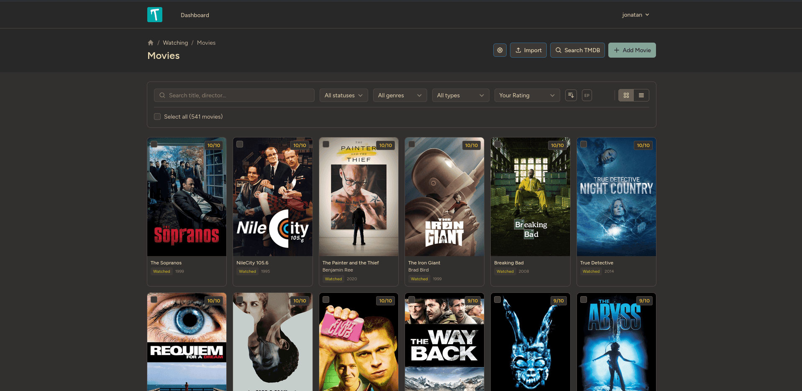

# TEAL

**The Essential Aggregator Library** -- a self-hosted media tracker for books, comics, movies, and anime.

<p align="center">
  
</p>

Built with Laravel 12, Livewire 3, and Tailwind CSS. Uses PostgreSQL by default.

## What it does

- Track books, comics, movies, and anime with status, ratings, dates, and notes
- Import from Goodreads (CSV), IMDb (CSV), and MyAnimeList (XML export / username)
- Search and add comics from Comic Vine, with per-issue tracking (volume/issue hierarchy)
- Fetch metadata and covers from OpenLibrary, TMDB, Jikan (MAL), and Comic Vine
- Gallery and list views with search, filtering, and sorting
- Reading queue for books
- Two themes out of the box (light and Gruvbox Dark)
- Single-user, per-account data isolation via policies

## Setup

Requires PHP 8.4+, Composer, Node.js, and npm.

```bash
git clone https://github.com/dotMavriQ/TEAL-Laravel.git
cd TEAL-Laravel
composer setup
```

`composer setup` handles dependency installation, `.env` creation, key generation, migrations, and asset building.

To start a dev server with queue worker, log tailing, and Vite:

```bash
composer dev
```

Or just the basics:

```bash
php artisan serve
```

Register an account at `/register` and you're in.

## External services (optional)

Movie metadata uses TMDB. If you want it, grab an API key from [themoviedb.org](https://www.themoviedb.org/settings/api) and add it to `.env`:

```
TMDB_API_KEY=your_key
TMDB_ACCESS_TOKEN=your_token
```

Comic search and metadata uses Comic Vine. Grab an API key from [comicvine.gamespot.com](https://comicvine.gamespot.com/api/) and add it to `.env`:

```
COMIC_VINE_API_KEY=your_key
```

Book metadata (OpenLibrary) and anime metadata (Jikan/MAL) work without API keys.

## License

MIT
